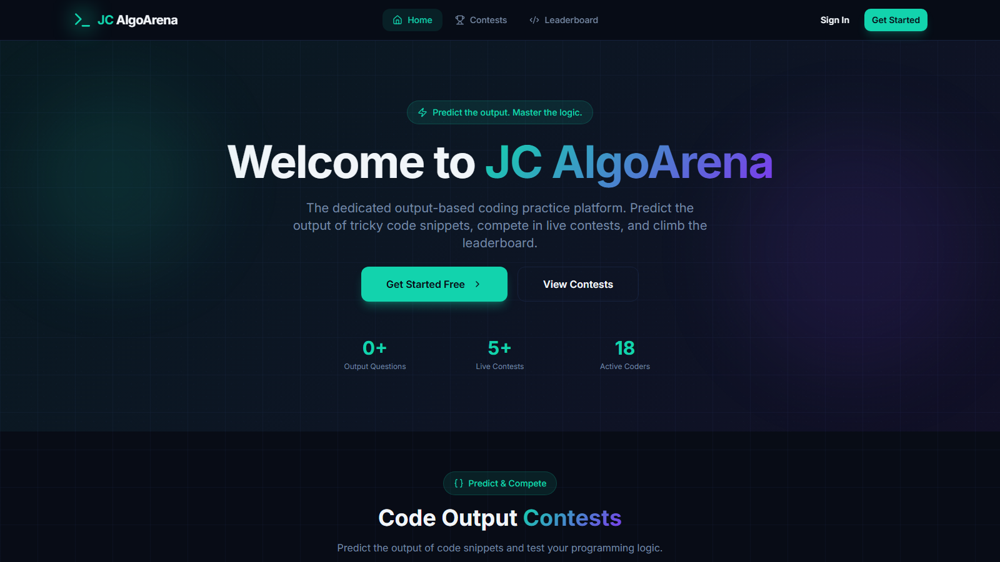
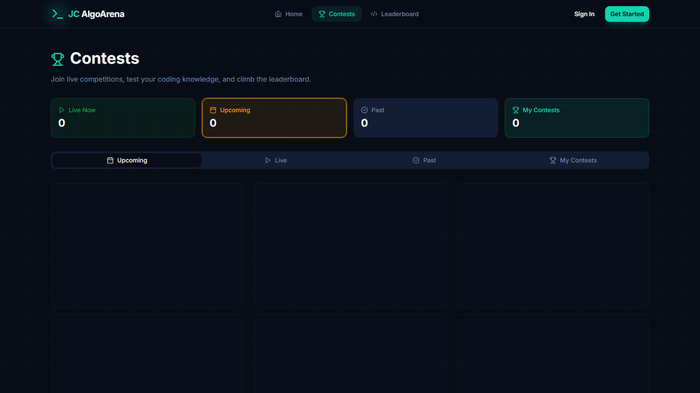
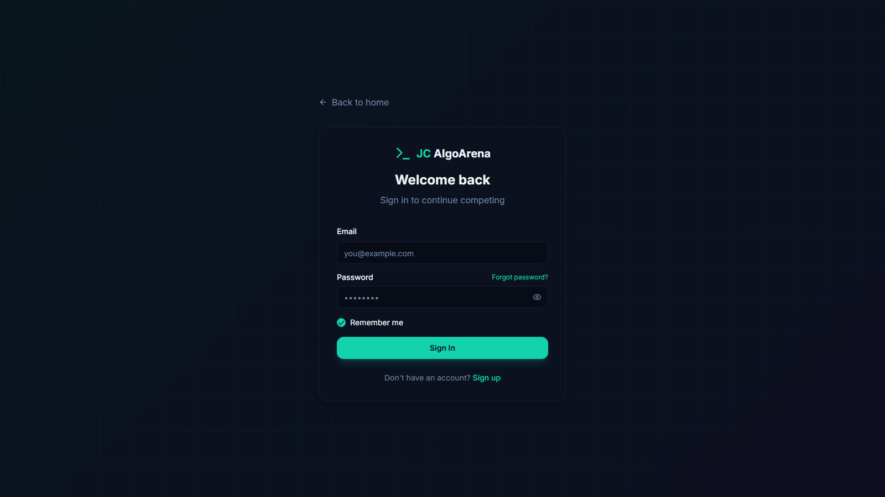

<div align="center">

# JC AlgoArena 🏆

**Competitive coding contests, quizzes, and practice — all in one platform.**

Take part in timed contests, solve MCQ challenges, climb the leaderboard, and earn certificates.

[](https://algoarena-9nwy.onrender.com)
[](https://react.dev/)
[](https://www.typescriptlang.org/)
[](https://vitejs.dev/)
[](https://supabase.com/)
[](https://tailwindcss.com/)
[](#license)

</div>

## ✨ Screenshots

| Home | Contests |
| :---: | :---: |
|  |  |
| **Sign in** | |
|  | |

## 🚀 Features

- **🧠 Contests** — daily, weekly, and special timed contests with live countdowns
- **🛡️ Anti-cheat** — detects tab switches and flags attempts to leave the contest window
- **🏅 Leaderboard** — global rankings with a podium view for top performers
- **📜 Certificates** — downloadable certificate cards for contest winners
- **🔐 OTP email auth** — passwordless sign-in via Supabase Edge Functions + Resend
- **📤 Result sharing** — share your score cards on WhatsApp or X
- **⚙️ Admin panel** — manage contests, questions, and published state
- **👤 Profiles & avatars** — upload an avatar and track your contest history

## 🛠 Tech Stack

| Layer | Tools |
| --- | --- |
| Frontend | [Vite](https://vitejs.dev/) · [React 19](https://react.dev/) · [TypeScript](https://www.typescriptlang.org/) |
| UI | [Tailwind CSS](https://tailwindcss.com/) · [shadcn/ui](https://ui.shadcn.com/) · [Radix UI](https://www.radix-ui.com/) · lucide-react |
| Routing & data | [React Router](https://reactrouter.com/) · [TanStack Query](https://tanstack.com/query) |
| Backend | [Supabase](https://supabase.com/) — database, auth, Edge Functions (Deno) |
| Email | [Resend](https://resend.com/) — transactional email for OTPs and contest reminders |
| Deployment | [Render](https://render.com/) — static site with auto-deploy from `main` |

## 🏁 Getting Started

**Prerequisites:** Node.js 18+ and npm.

```sh
# 1. Clone the repo
git clone https://github.com/sandeep780049/algoarena.git
cd algoarena

# 2. Install dependencies
npm install

# 3. Start the dev server
npm run dev
```

Then open **http://localhost:8080** in your browser.

The app reads Supabase configuration from `.env` at build time:

```dotenv
VITE_SUPABASE_URL=...
VITE_SUPABASE_PUBLISHABLE_KEY=...
VITE_SUPABASE_PROJECT_ID=...
```

### Available scripts

| Command | Description |
| --- | --- |
| `npm run dev` | Start the dev server on port 8080 |
| `npm run build` | Production build to `dist/` |
| `npm run preview` | Preview the production build locally |
| `npm run lint` | Run ESLint |

## ☁️ Supabase Edge Functions

The OTP and contest-email flows run as Supabase Edge Functions. Deploy them with:

```sh
supabase functions deploy send-otp
supabase functions deploy verify-otp
supabase functions deploy send-contest-email
supabase functions deploy send-contest-reminders
```

Set the `RESEND_API_KEY` secret, and make sure the `ALLOWED_ORIGINS` list in each function includes your deployed origin.

## 📦 Deployment

Deployed on [Render](https://render.com/) as a **Static Site** from this repository:

- **Build command:** `npm install && npm run build`
- **Publish directory:** `dist`
- **SPA rewrite:** the committed [`public/_redirects`](public/_redirects) file serves `index.html` for all unmatched routes so client-side routes like `/contests` work on refresh and direct navigation

New pushes to `main` auto-deploy.

## 🌐 Live Site

👉 **[https://algoarena-9nwy.onrender.com](https://algoarena-9nwy.onrender.com)**

## 🤝 Contributing

Contributions are welcome! Feel free to open an issue or submit a pull request.

1. Fork the repository
2. Create your feature branch (`git checkout -b feature/amazing-feature`)
3. Commit your changes (`git commit -m 'Add some amazing feature'`)
4. Push to the branch (`git push origin feature/amazing-feature`)
5. Open a Pull Request

## 📄 License

This project is licensed under the MIT License — see [LICENSE](LICENSE) for details.

---

<div align="center">

Made with ⚡ by [sandeep780049](https://github.com/sandeep780049)

</div>
